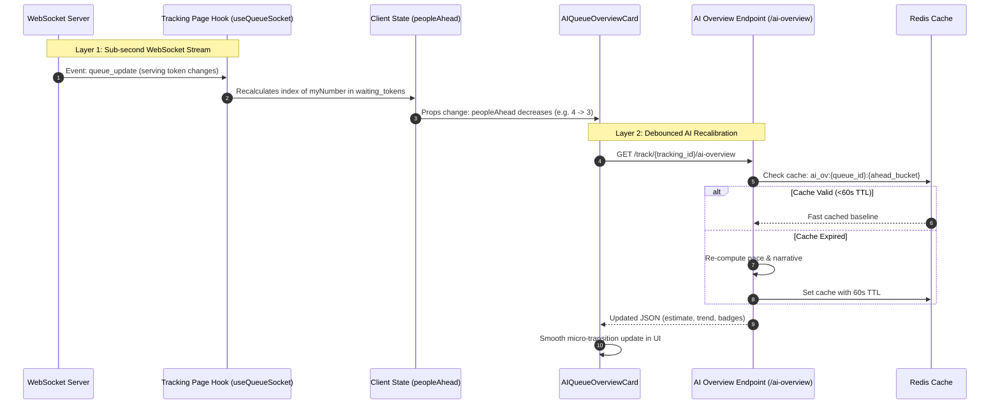

# AI Queue Overview — Architecture, Mathematical Logic & Real-Time Lifecycle

This document provides a comprehensive technical breakdown of the **Data-Driven AI Queue Overview** system built into Q4Queue. It details the underlying mathematical model, real-time synchronization lifecycle, failure isolation, and decision state machine.

---

## 1. High-Level Concept

The AI Queue Overview provides customers waiting in line with an intelligent, contextual prediction of their wait time. Rather than relying on static averages or third-party LLMs that can hallucinate wait times and add external latency, this engine executes a **deterministic, branch-specific statistical intelligence model**.

### Where It Appears
* **File:** [`frontend/app/track/[trackingId]/page.tsx`](file:///Users/muhammedmidlaj/Desktop/qrq-1/frontend/app/track/%5BtrackingId%5D/page.tsx)
* **Location:** Rendered directly above the customer's Ticket Card.
* **Visibility:** Active whenever the customer's ticket status is `waiting` and the session is open.

---

## 2. Mathematical Prediction Model

The backend prediction engine in [`backend/app/services/ai_overview_service.py`](file:///Users/muhammedmidlaj/Desktop/qrq-1/backend/app/services/ai_overview_service.py) executes a 6-stage algorithmic pipeline:

```
┌────────────────────────────────────────────────────────────────────────┐
│                        AI Prediction Pipeline                          │
├────────────────────────────────────────────────────────────────────────┤
│ 1. Historical Baseline Query (Past 4 Weeks, Same DOW, Same Hour)       │
│    - Extracts: avg(completed_at - served_at)                           │
│    - Outlier Filter: completed_at - served_at <= 3600 seconds          │
│                                                                        │
│ 2. Live Performance Query (Today's Last 45 Minutes)                    │
│    - Extracts: avg(completed_at - served_at)                           │
│    - Outlier Filter: completed_at - served_at <= 3600 seconds          │
│                                                                        │
│ 3. True Active Counter Detection (Session + 15m Recent)                │
│    - Counts: distinct lines/staff in TokenStatus.serving               │
│    - Adds: distinct lines/staff completed in last 15 minutes           │
│    - Zero-Counter Rule: If 0, enters PAUSED state (no division by 0)  │
│                                                                        │
│ 4. Blended Service Pace Calculation                                    │
│    - Formula: T_blended = (0.65 × T_live) + (0.35 × T_hist)           │
│    - Clamped: min(max(T_blended, 0.5), 30.0) minutes                  │
│                                                                        │
│ 5. Dining Party Multiplier (Pax Count)                                 │
│    - Multiplier = 1.0 + (max(0, pax_count - 2) × 0.08)                │
│                                                                        │
│ 6. Wait Time Interval Estimation                                       │
│    - Raw Estimate: (People Ahead × T_blended) / Active Counters        │
│    - Window: [Raw × 0.85, Raw × 1.20] minutes                         │
└──────────────────────────────────┬─────────────────────────────────────┘
                                   ▼
         Synthesizes Natural Narrative, Status Badges & Advice
```

### Stage 1: Historical Baseline ($T_{\text{hist}}$)
Every branch (`Organization`) has distinct customer volume patterns. A Friday evening at 7:00 PM behaves very differently from a Tuesday morning at 10:00 AM.
* The system resolves the branch's local timezone (`Organization.timezone`).
* Queries the past 28 days (4 weeks) for completed tokens that match:
  $$\text{EXTRACT}(\text{isodow FROM local\_created}) = \text{target\_dow} \quad\land\quad |\text{hour} - \text{target\_hour}| \le 1$$
* Outlier Filter: Only includes transactions completed within $\le 3600$ seconds ($\le 60$ minutes) to exclude abandoned test tokens.

### Stage 2: Live Calibration ($T_{\text{live}}$)
To account for today's staffing efficiency and immediate traffic:
* Queries tokens completed in the last **45 minutes** of the current session.
* Computes real-time average service duration:
  $$T_{\text{live}} = \text{AVG}(\text{completed\_at} - \text{served\_at}) / 60.0$$

### Stage 3: True Active Counters ($C_{\text{active}}$)
Instead of assuming all counters are staffed:
* Evaluates distinct lines or staff currently in `TokenStatus.serving` for the active session.
* Plus distinct lines or staff who completed tokens within the last 15 minutes.
* **Zero-Counter Invariant:** If no staff are active or the queue is paused, $C_{\text{active}} = 0$. The system **never** forces this to 1; it triggers the **Counters on Pause** state without calculating division.

### Stage 4: Weighted Blending
If both historical and live samples are available ($N \ge 3$):
$$T_{\text{blended}} = (0.65 \times T_{\text{live}}) + (0.35 \times T_{\text{hist}})$$
* If the branch is new with no historical data yet, it uses $T_{\text{live}}$.
* If the session just began with no live completions yet, it uses $T_{\text{hist}}$.
* The blended duration is bounded between $0.5$ and $30.0$ minutes to guard against extreme test anomalies.

### Stage 5: Dining Party Size Multiplier
For restaurant or dine-in queues where groups occupy tables:
$$\text{Multiplier} = 1.0 + \max(0, \text{pax\_count} - 2) \times 0.08$$
Larger parties require slightly more table turnaround time.

### Stage 6: Estimated Wait Interval
$$\text{Estimated Wait} = \text{round}\left( \frac{\text{People Ahead} \times T_{\text{blended}} \times \text{Multiplier}}{C_{\text{active}}} \right)$$
* $\text{Estimated Min} = \max(1, \text{round}(\text{Estimated Wait} \times 0.85))$
* $\text{Estimated Max} = \max(\text{Estimated Min} + 2, \text{round}(\text{Estimated Wait} \times 1.20))$

---

## 3. Real-Time Synchronization Lifecycle (How It Updates Live)

The customer page does **not** rely on heavy, full-page reloads. It uses a **two-layer reactive architecture**:



### 1. Instant Client-Side Reaction ($< 50\text{ms}$)
* When a staff member clicks **Next** or completes a token at any counter, the backend publishes a WebSocket message through Redis Pub/Sub.
* [`useQueueSocket`](file:///Users/muhammedmidlaj/Desktop/qrq-1/frontend/hooks/useQueueSocket.ts) on the customer tracking page receives the snapshot immediately.
* The frontend immediately re-computes `peopleAhead`:
  ```typescript
  const idx = live.waiting_tokens.findIndex((t) => t.token_number === myNumber);
  peopleAhead = idx !== -1 ? idx : joinData?.position;
  ```
* The customer's on-screen ticket count drops instantaneously with zero lag.

### 2. AI Overview Recalibration
* [`AIQueueOverviewCard`](file:///Users/muhammedmidlaj/Desktop/qrq-1/frontend/components/AIQueueOverviewCard.tsx) monitors `peopleAhead` and `trackingId`.
* When `peopleAhead` decreases (or on a fallback 50-second interval), it requests fresh insights from:
  `GET /api/v1/track/{tracking_id}/ai-overview`
* To prevent duplicate database queries across multiple customers waiting in the same queue, Redis caches responses bucketed by position:
  `ai_ov:{queue_id}:{ahead_bucket}:pax_{pax}:p_{paused}:c_{closed}` with a 60-second TTL.

---

## 4. State Machine & Visual Narrative Matrix

The engine maps calculated metrics into human-friendly advice and color-coded status chips:

| Condition | Badge Type | Color Accent | Trend Title Example | Actionable Advice Example |
| :--- | :--- | :--- | :--- | :--- |
| **`peopleAhead === 0`** | `almost_turn` | Indigo (`#6366f1`) | *"You are next in line!"* | *"The counter is preparing to call your token. Please proceed to the service area immediately."* |
| **Pace Ratio $\ge 1.20$** | `fast` | Emerald (`#10b981`) | *"Moving ~25% faster than typical Thursdays"* | *"Counters are rotating rapidly. Please stay near the lobby."* |
| **Pace Ratio $\le 0.80$** | `slow` | Orange (`#f97316`) | *"Peak rush: heavier traffic than usual"* | *"Safe for a quick coffee nearby. We recommend heading back when 2 people remain."* |
| **Normal ($0.80 - 1.20$)** | `normal` | Blue / Brand | *"Steady flow consistent with typical Thursdays"* | *"Moderate wait. Feel free to relax nearby; keep this screen open for live alerts."* |
| **Active Counters = 0 or Paused** | `paused` | Amber (`#f59e0b`) | *"Counters currently on break / on hold"* | *"Service is temporarily paused. Wait time predictions will resume once a counter opens."* |
| **Queue Closed / Session Ended** | `closed` | Slate (`#64748b`) | *"Queue is currently closed"* | *"This queue session has closed for the day. Please check back during operating hours."* |

---

## 5. Failure Isolation & Resilience Guarantees

1. **Non-Blocking Architecture:**
   * In [`frontend/components/AIQueueOverviewCard.tsx`](file:///Users/muhammedmidlaj/Desktop/qrq-1/frontend/components/AIQueueOverviewCard.tsx), the AI overview request is wrapped in an isolated `try/catch`.
   * If the network drops, Redis is restarting, or the endpoint returns an error, the AI card simply hides gracefully without displaying an error alert.
   * The core ticket number, live status, and queue position continue functioning completely uninterrupted.
2. **Backend Defensive Fallback:**
   * In [`backend/app/api/v1/endpoints/tracking.py`](file:///Users/muhammedmidlaj/Desktop/qrq-1/backend/app/api/v1/endpoints/tracking.py), any unexpected calculation error is caught and returns a safe 200 JSON fallback containing basic position data so the client never receives an unhandled 500 error.

---

## 6. Key Source Files

* **Intelligence Service:** [`backend/app/services/ai_overview_service.py`](file:///Users/muhammedmidlaj/Desktop/qrq-1/backend/app/services/ai_overview_service.py)
* **API Schema:** [`backend/app/schemas/queue.py`](file:///Users/muhammedmidlaj/Desktop/qrq-1/backend/app/schemas/queue.py#L411-L425)
* **API Endpoint:** [`backend/app/api/v1/endpoints/tracking.py`](file:///Users/muhammedmidlaj/Desktop/qrq-1/backend/app/api/v1/endpoints/tracking.py#L174-L267)
* **Frontend Component:** [`frontend/components/AIQueueOverviewCard.tsx`](file:///Users/muhammedmidlaj/Desktop/qrq-1/frontend/components/AIQueueOverviewCard.tsx)
* **Tracking Page Integration:** [`frontend/app/track/[trackingId]/page.tsx`](file:///Users/muhammedmidlaj/Desktop/qrq-1/frontend/app/track/%5BtrackingId%5D/page.tsx#L685-L691)
* **Unit Tests:** [`backend/tests/unit/test_ai_overview_service.py`](file:///Users/muhammedmidlaj/Desktop/qrq-1/backend/tests/unit/test_ai_overview_service.py)
